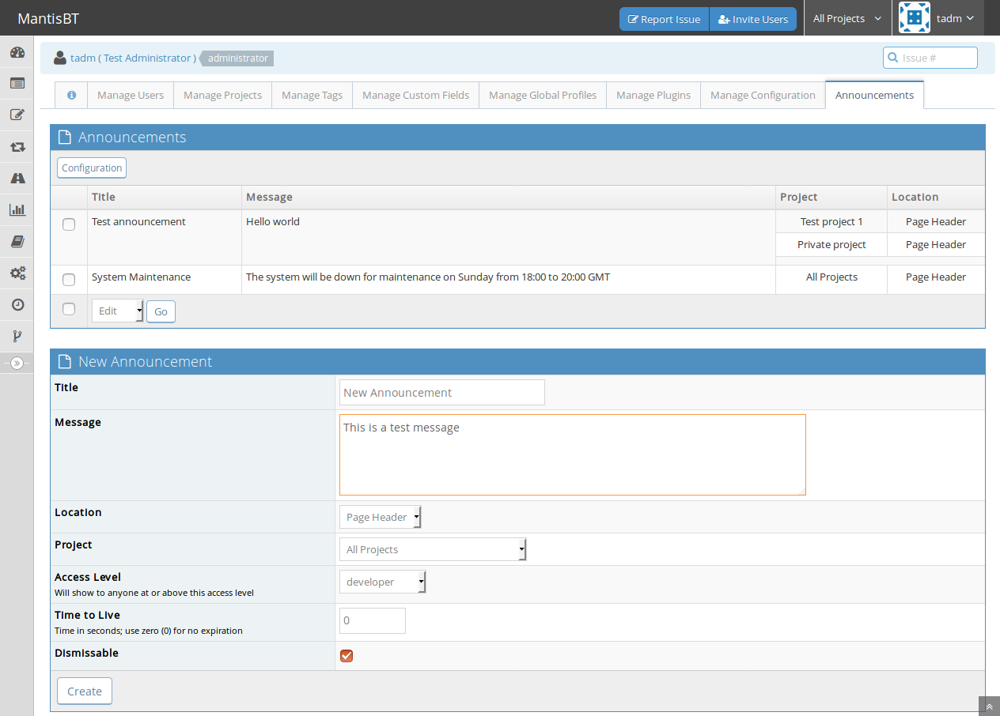
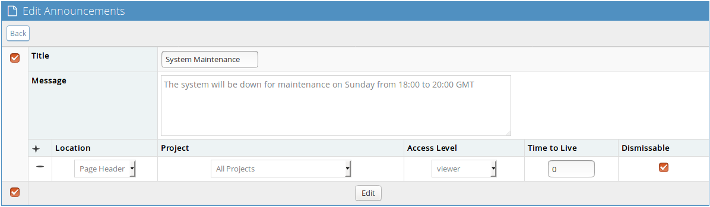
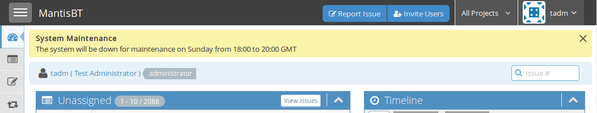
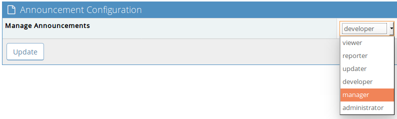

# Announcements plugin for MantisBT

Copyright (c) 2010 John Reese - http://noswap.com  
Copyright (c) 2017 Damien Regad

Released under the [MIT license](http://opensource.org/licenses/MIT)

See the [Changelog](https://github.com/mantisbt-plugins/Announce/blob/master/CHANGELOG.md).


## Description

Lets privileged accounts create and post announcements that can be shown to
users on a global or per-project basis, and allow users to dismiss individual
messages.


## Requirements

- MantisBT 2.3.0 or above

If you need compatibility with older releases of MantisBT, please use legacy
versions of the plugin, as per table below:

MantisBT version | Plugin version 
:---:|:---:
| 1.3 | [1.0.0](https://github.com/mantisbt-plugins/Announce/releases/tag/v1.0.0)
| 1.2 | [0.3](https://github.com/mantisbt-plugins/Announce/releases/tag/v0.3)


## Installation

1. Install the plugin's code
   - **From a zip/tarball**
     1. [Download](https://github.com/mantisbt-plugins/Announce/releases/latest)
        the plugin's latest release from GitHub
     2. Create a new directory `Announce` (note the capital 'A', it's case-sensitive)
        under MantisBT's `/plugins` directory
     3. Extract all files into the new directory
   - **From the source repository**  
     In MantisBT's `/plugins` directory, clone the repository 
        ```
        git clone https://github.com/mantisbt-plugins/Announce
        ```
2. Go to _Manage -> Manage Plugins_ and install the plugin.


## Usage

A new *Announcements* item is added to the Manage menu, as shown in the
following screenshot.



From there, new announcements can be added, targeted at _All Projects_ or a
specific one, restricted by access levels and limited in time.
Existing announcements can be edited and deleted.



At this time, the Announcements can only be displayed at the top of the page
(Location = *Page Header*), like in the example below. 
In the future, other options may be added.



The *Configuration* page lets the Administrator determine what access levels
are allowed to manage announcements.




## Support

The following support channels are available if you wish to file a
[bug report](https://github.com/mantisbt-plugins/Announce/issues/new),
or have questions related to use and installation:

  - [GitHub issues tracker](http://github.com/mantisbt-plugins/Announce/issues)
  - MantisBT [Gitter chat room](https://gitter.im/mantisbt/mantisbt)
  - If you feel lucky you may also want to try the legacy
    [#mantisbt IRC channel](https://webchat.freenode.net/?channels=%23mantisbt)
    on Freenode (irc://freenode.net/mantisbt)
    but since hardly anyone goes there nowadays, you may not get any response.
